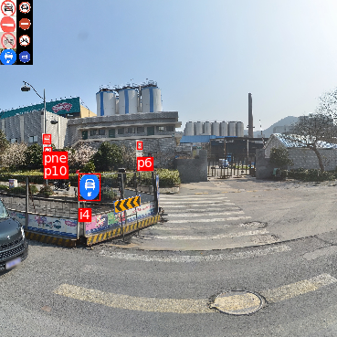

# PyTorch-YOLOv3


## 1. Installation
### 1.1. git clone
```python
git clone https://github.com/yangzhaonan18/yolov3_trafficSign_pytorch
```  
    
### 1.2. Download pretrained weights
1. Download detection(yolov3) weights:
Baidu network disk link(234MB): https://pan.baidu.com/s/1BWySwi22nsFTB7-c0ualZA

download  and put it at: ./checkpoints/yolov3_ckpt_33.pth

2. Download classifier(CNN) weights:
Baidu network disk link(43MB): https://pan.baidu.com/s/1Id65qVFrAp-S5G--57LG2Q

download  and put it at: ./ALL_sign_data/checkpoints/

### 1.3. Detect and classify an image
```python
python3 detection_and_classification.py
```
detect the images in "./image_for_detect/Tinghua100K/", 
and the images with results will be saved in "./output", the "Tinghua100K_result.json" result will be saved in "./result/"

images with results:
<p align="center">
  
</p>

## 2. How to test the results?
```
cd Tinghua100K_data/python/
python3 my_result_classes.py

```

results is:
```
iou:0.5, size:[0,400), types:[w55, ...total 53...], accuracy:0.8845589434208381, recall:0.9304519337964154
iou:0.5, size:[0,32), types:[w55, ...total 53...], accuracy:0.8160990712074303, recall:0.885752688172043
iou:0.5, size:[32,96), types:[w55, ...total 53...], accuracy:0.9297398348652438, recall:0.9740492900277461
iou:0.5, size:[96,400), types:[w55, ...total 53...], accuracy:0.9261477045908184, recall:0.8672897196261682
iou:0.5, size:[0,400), types:w55, accuracy:0.9611650485436893, recall:0.908256880733945
iou:0.5, size:[0,400), types:p27, accuracy:0.9156626506024096, recall:0.9047619047619048
iou:0.5, size:[0,400), types:il80, accuracy:0.9746192893401016, recall:0.9746192893401016
iou:0.5, size:[0,400), types:i1, accuracy:0.8571428571428571, recall:1.0
iou:0.5, size:[0,400), types:il100, accuracy:0.89, recall:0.967391304347826
......
......
```

## 3. How to train my dataset?
### 3.1. Train YOLOv3 detection
1. Download pretrained weights(on COCO): darknet53.conv.74 
```
cd ./weights
bash download_weights.sh
```


2. Train YOLOv3 detection

```
cd ../
python3 train.py --data_config config/Tinghua100K.data --pretrained_weights weights/darknet53.conv.74
```

The YOLOv3 training weights will be saved in ./checkpoints/
### 3.2. Train CNN classifier 
1. Download traffic sign data to train classifier
Baidu network disk link: https://pan.baidu.com/s/133wOElvWHn0Fm4RzOGLk3w
and unzip it in ALL_sign_data/ALL_data_in_2_train/

```
cd ./ALL_sign_data/
bash  run.sh
```

The train weights will be saved in ./ALL_sign_data/checkpoints


## 4. how to train your dataset for YOLOv3?

### 4.1 Prepare dataset

1. The data set is stored in folder : /headless/Desktop/yzn_file/DataSet_traffic_sign/
which contains 3 datasets: 

* CCTSDB_changsha
* GTSDB
* Tinghua_100K

2. each file contains three files(most important)

* images_jpg : jpg images
* labels: txt label for YOLOv3
* labels_xml: xml label for VOC dataset

3. scripts

2_2voc_label.py : convert the three files  "CCTSDB_changsha", "GTSDB", "Tinghua_100K" train and test label from .xml(VOC) to .txt(YOLOv3) and create the image path file of three datasets.

The "train.txt" and "test.txt" contain the images's absolute path will be saved in ./ALL_DATA

### 4.2. Creat the images's absolute path
```
cd  /headless/Desktop/yzn_file/DataSet_traffic_sign/
python3 2_2voc_label.py
```

### 4.3. Train 
```
cd ../yolov3_trafficSign_pytorch


#  train from yolo pretrained weights:darknet53.conv.74
python3 train.py --pretrained_weights weights/darknet53.conv.74

or 
#  train from my pretrained weights:yolov3_ckpt_33.pth
python3 train.py --pretrained_weights checkpoints/yolov3_ckpt_33.pth
```
* Train logs
```
---- [Epoch 0/300, Batch 39/19133] ----
+------------+--------------+--------------+--------------+
| Metrics    | YOLO Layer 0 | YOLO Layer 1 | YOLO Layer 2 |
+------------+--------------+--------------+--------------+
| grid_size  | 38           | 76           | 304          |
| loss       | 20.597389    | 15.203256    | 22.110357    |
| x          | 0.153537     | 0.110538     | 0.065873     |
| y          | 0.059418     | 0.069747     | 0.058901     |
| w          | 2.156327     | 0.737079     | 0.113998     |
| h          | 1.517446     | 0.609778     | 0.385179     |
| conf       | 16.404194    | 13.595131    | 20.615255    |
| cls        | 0.306469     | 0.080982     | 0.871151     |
| cls_acc    | 100.00%      | 100.00%      | 100.00%      |
| recall50   | 0.000000     | 0.000000     | 0.000000     |
| recall75   | 0.000000     | 0.000000     | 0.000000     |
| precision  | 0.000000     | 0.000000     | 0.000000     |
| conf_obj   | 0.283539     | 0.095890     | 0.186076     |
| conf_noobj | 0.138449     | 0.103401     | 0.168427     |
+------------+--------------+--------------+--------------+
Total loss 57.91100311279297
---- ETA 3:00:59.369194
path ['/headless/Desktop/yzn_file/DataSet_traffic_sign/CCTSDB_changsha/images_jpg/train/06006.jpg']

```

